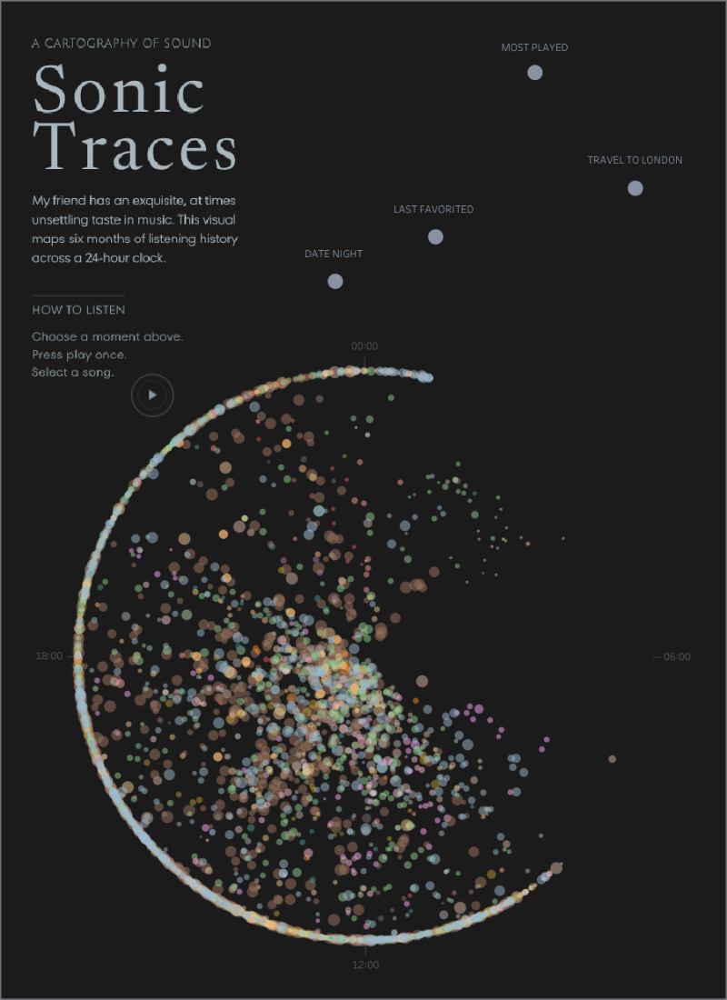

# Sonic Traces Player

### A cartography of sound

**Sonic Traces** is an interactive Tableau data story built from six months of a friend's listening history. Every song is mapped onto a 24-hour clock, revealing recurring listening patterns and the moments they belong to.

Viewers can select meaningful moments, explore the songs associated with them, and listen to audio previews directly from the visualization.

To make this possible, I built a custom audio extension that connects the Tableau visualization with track previews. It extends the visual exploration into sound, allowing the data to be experienced rather than only viewed.

By combining **Tableau, JavaScript, interaction, and audio**, the project transforms personal listening data into an editorial data experience.

**[Explore Sonic Traces on Tableau Public →](https://public.tableau.com/app/profile/janina.grauel/viz/SonicTraces-SoundOn/SonicTraces)**

**Built with:** JavaScript · HTML · CSS · Tableau Extensions API

## Deployment

1. Copy your existing `tableau.extensions.1.latest.js` into this folder beside `index.html`.
2. Upload all files and the `api` folder to a new GitHub repository.
3. In Vercel choose Add New → Project, import the repository, framework Other, then deploy.
4. Test: `https://YOUR-PROJECT.vercel.app/api/deezer-preview?id=143661438`.
5. Replace `YOUR-VERCEL-PROJECT` in the `.trex` template with the real project name.
6. Load the new `.trex` in Tableau Desktop and publish again.

`Radial` needs `deezer_track_id`, `Title`, and `Artist` on Detail.
